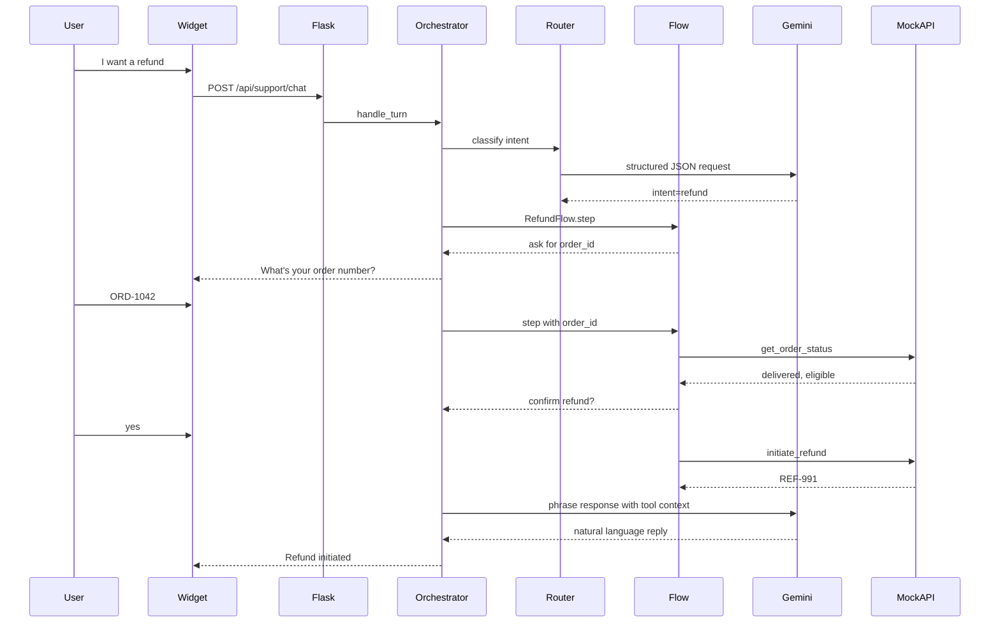

# Bookly Support Agent

A customer support agent for **Bookly**, a fictional online bookstore. It handles order status, refunds/returns, and general FAQ (shipping, policies, password reset), and ships as an installable Python package with a CLI demo, Flask API, and embeddable chat widget.

## How to Use

1. Navigate to [getlitly.com](https://getlitly.com)
2. Create an account or use the test login:
   - Email: `jdsouza0325+testuser1@gmail.com`
   - Password: `password123`
3. Try the CX Agent

**Test flows:**

- When will I receive my book? (ORD-1042)
- My book is damaged
- How do I reset my password?

## Thesis

**The LLM understands language; Python owns business logic and side effects.**

Rather than letting a model freely chain tools in a ReAct loop, this agent uses a hybrid design:

1. **Router** — one Gemini call with structured JSON output to classify intent and extract slots
2. **Flows** — deterministic state machines for multi-turn workflows (collect order ID → confirm → execute)
3. **Tools** — plain Python functions against a mock order store
4. **Policies** — explicit gates (confirmation before refund, invalid order ID handling, low-confidence clarification)
5. **Response generation** — Gemini phrases the final reply using tool results as grounded context

This makes every decision inspectable, demo-safe, and easy to extend to real Bookly APIs.

## Architecture



### Components

| Layer | Module | Responsibility |
|-------|--------|----------------|
| Orchestrator | `bookly_agent/orchestrator.py` | Turn loop: route or continue flow, invoke tools, return reply |
| Router | `bookly_agent/router.py` | Intent classification via Gemini structured output |
| Flows | `bookly_agent/flows/` | State machines for `order_status`, `refund`, `general_faq` |
| Tools | `bookly_agent/tools/` | `get_order_status`, `initiate_refund` against `data/mock_orders.json` |
| Policies | `bookly_agent/policies.py` | Clarification thresholds, confirmation detection, order ID validation |
| LLM | `bookly_agent/llm/` | Direct Gemini REST calls (no LangChain) |
| State | `bookly_agent/state.py` | In-memory session store keyed by `session_id` |

## Turn lifecycle: refund example

1. **User:** "I need a refund"
2. **Router** classifies `intent=refund`, starts `RefundFlow` at `awaiting_order_id`
3. **Flow** has no order ID → returns clarifying question
4. **User:** "ORD-1042"
5. **Flow** advances to `awaiting_reason` → asks for reason
6. **User:** "Damaged cover"
7. **Flow** calls `get_order_status` tool, checks `refund_eligible`, moves to `confirm`
8. **User:** "yes"
9. **Flow** calls `initiate_refund` tool → `{refund_id: REF-991}`
10. **LLM** generates a friendly confirmation using tool context (does not invent IDs)

## Intent routing

The router sends Gemini a JSON schema constrained response:

```json
{
  "intent": "order_status | refund | general_faq | unknown",
  "confidence": 0.92,
  "slots": { "order_id": "ORD-1042", "reason": "..." },
  "rationale": "..."
}
```

If `confidence < 0.65` or `intent == unknown`, the agent asks a clarifying question instead of guessing.

## Flow state machines

**Order status:** `awaiting_order_id` → `lookup` (tool) → `respond`

**Refund:** `awaiting_order_id` → `awaiting_reason` → `confirm` → `execute` (tool) → `respond`

**General FAQ:** detect topic → return policy snippet → LLM paraphrase

## Tool layer

Mock data in `bookly_agent/data/mock_orders.json` includes:

- `ORD-1042` — delivered, refund-eligible (happy path)
- `ORD-2088` — in transit, not yet eligible
- `ORD-3011` — already refunded

Swap `BOOKLY_AGENT_DATA_PATH` or replace tool implementations to connect to real Bookly APIs.

## Policy and safety

- Refunds require explicit user confirmation ("yes") before `initiate_refund` runs
- Invalid order IDs (not matching `ORD-####`) trigger re-prompt, not tool calls
- Low-confidence routing asks a clarifying question
- The LLM receives tool results as context and is instructed not to invent order details

## Key technical decisions

| Decision | Choice | Why |
|----------|--------|-----|
| LLM | Gemini 2.5 Flash | Structured JSON output, existing API setup, sufficient for 3–4 tool flows |
| Orchestration | Hand-rolled Python | For visible architecture |
| State | In-memory sessions | Fine for demo; Redis/SQLite upgrade path |
| Tools | Mock JSON store | Safe, traceable, no external dependencies for evaluators |
| API key | Backend-proxied | Widget never sees `GEMINI_API_KEY` |
| Agent framework | None | Direct `urllib` to Gemini REST API |

## Running locally

### CLI (no host app required)

```bash
cd bookly-agent
python3 -m venv .venv && source .venv/bin/activate
pip install -e ".[dev]"
cp .env.example .env   # add GEMINI_API_KEY, or use mock mode
export BOOKLY_AGENT_MOCK_LLM=true   # optional offline mode
bookly-agent
```

Try: `I need a refund` → `ORD-1042` → `damaged` → `yes`

### Tests

```bash
pytest
```

## Embedding in Litly

[Litly](https://github.com/your-org/litly) hosts the widget for the live demo.

```bash
# From litly repo root
pip install -e ../bookly-agent
```

Add to litly `.env`:

```
BOOKLY_AGENT_ENABLED=true
GEMINI_API_KEY=your-key
```

When enabled, a **Bookly Support** floating widget appears on every page. The widget calls `POST /api/support/chat` on the litly server, which delegates to this package's orchestrator.

## Tradeoffs and next steps

- **Persistence:** Sessions are in-memory; production would use Redis or SQLite
- **Auth:** No customer identity verification; would tie `session_id` to logged-in user + order ownership checks
- **Human handoff:** Add escalation intent + queue integration
- **Evals:** Script multi-turn conversations against mock LLM for regression testing
- **Voice:** Add Web Speech API in widget or a separate Twilio/Deepgram pipeline

## Project structure

```
bookly-agent/
├── bookly_agent/              # Core agent package
│   ├── data/mock_orders.json  # Mock Bookly order store
│   └── server/widget/         # Embeddable chat UI assets
├── tests/
└── README.md
```

